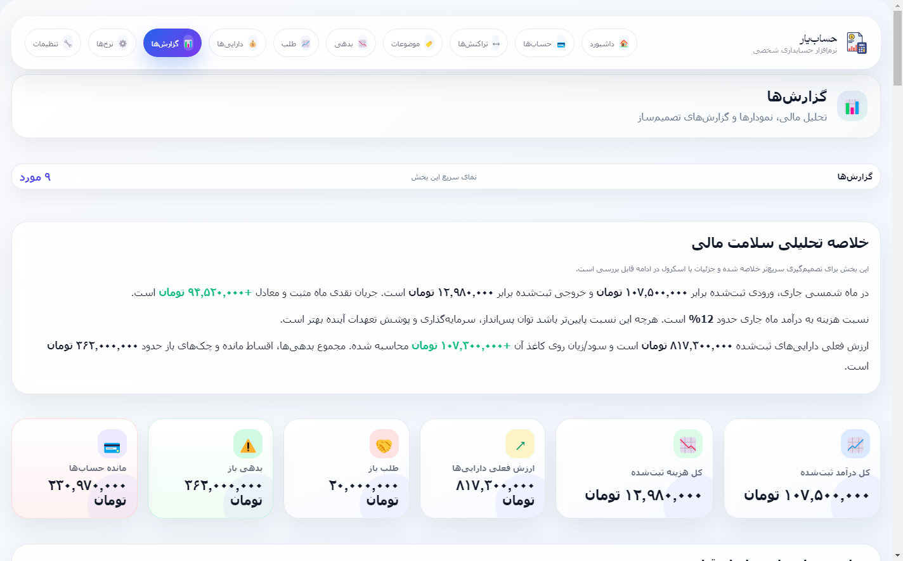
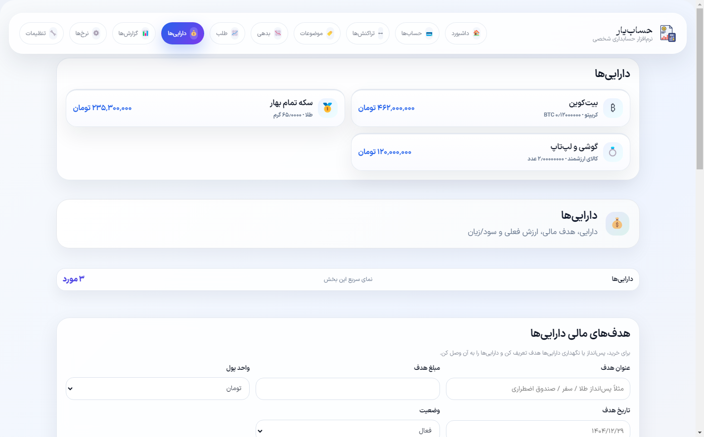
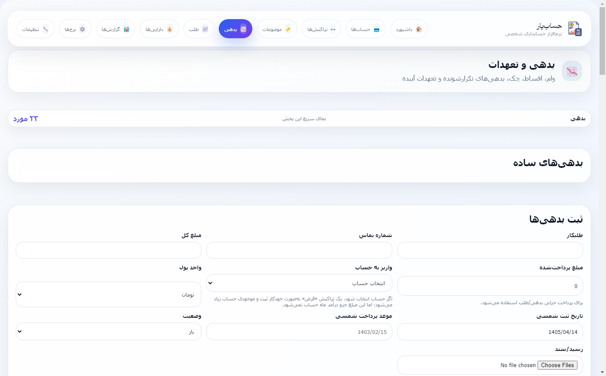
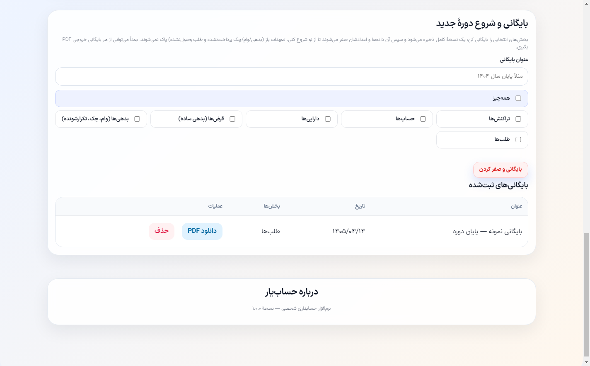
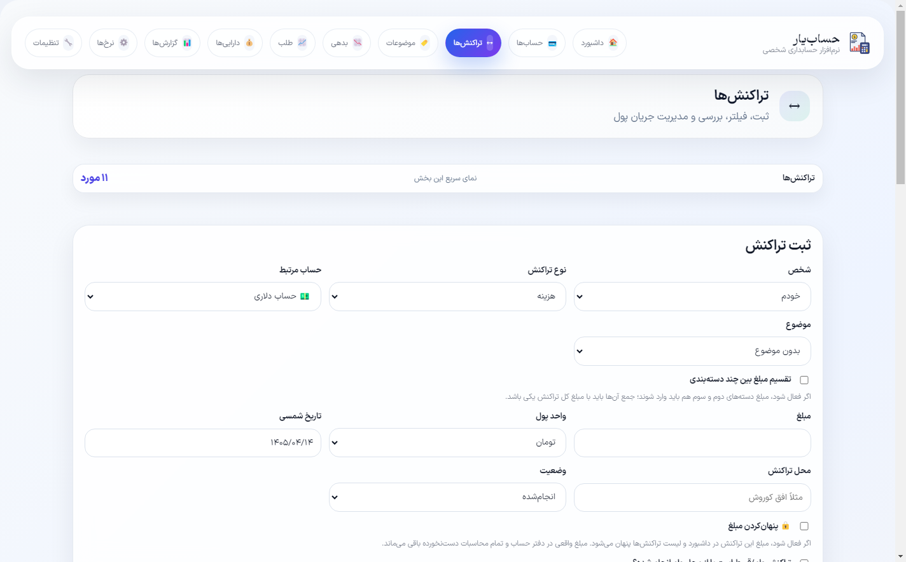

<div align="center">


# HesabYar — حساب‌یار

### The Persian personal‑accounting suite for Windows — offline‑first, precise, and beautiful.

<p>


</p>


<em>No account. No cloud dependency. No subscription. Your money data stays in a single file on your PC —<br>and syncs to your own site only when <strong>you</strong> ask it to.</em>

</div>

---

> **On language.** This README is in English, but the app itself is **100% Persian (RTL)** — Toman/Rial, Jalali (Shamsi) dates, Persian numerals, and live TGJU market rates. It reproduces **every feature and every accounting rule** of the "Personal Accounting" WordPress plugin it was ported from.

## 💡 Why HesabYar

Most budgeting apps are a shoebox of transactions with a pie chart bolted on. HesabYar is a **real double‑sided ledger**: it knows the difference between *spending* money, *moving* money, *investing* money, and *borrowing* money — so your income, your expenses, and your **net worth** stay honest even when your finances get complicated (loans, cheques, gold, foreign currency, money lent to friends).

- 🔒 **Offline‑first & private** — a single local SQLite file; works with the network cable pulled out.
- 🎯 **Accounting that doesn't lie** — borrowing isn't income, repaying isn't an expense (see [the model below](#-the-accounting-model-precisely)).
- 🖥️ **1:1 with the web app** — same server‑rendered UI, so nothing is "the desktop version of."
- 🔁 **Your‑hub sync** — optional two‑way sync through your own WordPress site; now runs **automatically in the background**.

## ✨ Features at a glance

| Area | What you get |
|---|---|
| 📊 **Dashboard** | Monthly surplus/deficit hero · live USD & 18k‑gold rates · KPI cards (balances, asset value with P&L, open receivables/debts, monthly income & expense) · due‑date reminders (installments, cheques, recurring) · expense breakdown · recent activity & upcoming obligations |
| 🏦 **Accounts** | Cash / bank / credit · multi‑currency (Toman, Rial, USD, EUR…) · opening balances · card/IBAN · reconciliation · personal **journal**, **general ledger**, **monthly statements** |
| 🔁 **Transactions** | **11 typed operations** (see below) · category splitting · multi‑tag · receipts (image/PDF) · amount‑hiding · duplicate detection · powerful filters · step‑by‑step entry wizard |
| 🏷️ **Categories** | Icon + color · **essential / non‑essential** flag that drives the "needs vs wants" reports |
| 📉 **Debts & obligations** | Simple debts · **loans with auto‑generated installment schedules** (incl. variable amounts) · **cheques** (multi‑count) · **recurring** (rent, insurance, subscriptions) · future‑pressure reports |
| 📈 **Receivables** | Money you're owed — full & partial collection tracking |
| 💎 **Assets** | Gold, silver, crypto, cash currency, property, car, valuables · **live market valuation** · realized/unrealized **P&L** · financial **goals** with progress |
| 📄 **Reports** | Financial‑health summary · savings & debt‑to‑asset ratios · money in/out routes · essential vs non‑essential · per‑item spending · per‑person breakdown · 6‑month income/expense chart · spend‑by‑place · financial calendar · per‑group asset P&L · **PDF export** · **JSON backup/restore** |
| 💱 **Rates** | Currency, gold & crypto · one‑click **online update** (TGJU) · manual entry |
| ⚙️ **Settings** | Light/dark · default currency · person labels · **PIN lock** · recycle bin · **site connection** · **Archive** (close a period) |

## 🧮 The accounting model, precisely

This is what sets HesabYar apart, so it's worth spelling out. Every transaction is one of **11 types**, and each type is classified along two independent axes: **does it move cash?** and **is it income / expense / neither?**

**The five buckets** (the exact rule sets used in code):

| Bucket | Types in it | Effect |
|---|---|---|
| **Real expense** | `expense`, `recurring_debt` | ➖ counts against your P&L and "needs vs wants" |
| **Real income** | `income` | ➕ the only thing that counts as earnings |
| **Financing — out** | `debt_settlement`, `loan_installment`, `check_settlement`, `asset_buy` | 💸 cash leaves, but it's **repayment/investment**, *not* an expense |
| **Financing — in** | debt/loan `borrow` (auto `debt_incur`), `asset_sell`, `receivable_settlement` | 💰 cash arrives, but it's **borrowing/divestment**, *not* income |
| **Transfer** | `account_transfer`, `person_transfer` | ↔️ money changes pockets; never income or expense |

**Why this matters — the classic double‑count, eliminated.** Borrow 10M and your balance rises, but it is **never** booked as income. Spend that 10M on a fridge → a normal **expense**. Later repay the loan → that repayment is **financing‑out**, *not* a second expense. Without this distinction, naïve apps count the money as spent **twice** (once buying the fridge, once repaying the loan) and show a phantom loss. HesabYar counts it exactly **once**.

**Balances vs analytics are computed from different sets.** Account balances and the balance‑trend sparkline use `cash_in_types` / `cash_out_types` (**all** money movement, so every rial is accounted for). The P&L, monthly chart, "essential", and expense‑breakdown reports use the **true‑expense/true‑income** sets above. That's why your balance is always correct *and* your "how much did I actually spend this month" figure is honest.

**Net worth** = liquid accounts **＋** current market value of assets **－** open (unsettled) debts, loan balances & cheques. Asset value is `quantity × live_rate`; the difference from purchase cost is **unrealized P&L** until you sell, when it becomes **realized**.

**Archiving = absolute‑zero period close.** Settings → **بایگانی** snapshots the groups you tick (`tx`, `accounts`, `assets`, simple debts, other liabilities, receivables, or `all`) into `hpa_archives`, then **resets their figures to zero** to start a fresh period — accounts and opening balances are wiped rather than carried forward. Crucially, **open obligations are preserved**: only *settled* debts/loans/cheques/receivables (and their directly‑linked transactions) are archived and removed, so balances and net worth stay coherent across the close. Each archive is exportable to **PDF**.

## 🔁 Background sync (new in 1.4.0)

Settings → **اتصال به سایت** connects the app to your WordPress site's REST API (`/wp-json/hpa/v1`). Once connected:

- ⚡ **Auto‑push** — every change you save is quietly pushed to the site **in the background**, with no "sync" button to press.
- ⬇️ **Auto‑pull on launch** — on open, any newer data from the site is merged in, in the background.
- 🧵 **Non‑blocking** — sync is debounced and off the UI thread; you never wait on it.
- 🛟 **Crash‑safe** — close the app mid‑sync and the next launch reconciles both ways (pull site → local, then push local → site).

The desktop schema mirrors the plugin's tables row‑for‑row, so records map cleanly in both directions.

## 📥 Download & install

From the [**Releases**](../../releases) page:

- **`HesabYar-Setup-1.4.0.exe`** — Windows installer (choose location, shortcuts).
- **`HesabYar-Portable-1.4.0.exe`** — single‑file portable, no install.

Requires 64‑bit Windows 10/11.

## 🛠️ Build from source

```bash
npm install     # dependencies
npm start       # run in development
npm run dist    # build installer + portable into ./release
```

## 🧩 Under the hood

- **Electron** shell with a **local render server** (`electron/server.js`) — the UI is the very same server‑rendered HTML as the WordPress plugin, which is why it's a true 1:1 port.
- **SQLite** via `sql.js` (pure‑WASM, no native build); DB lives at `%AppData%/HesabYar/hesabyar.sqlite`.
- Faithful JS port of the plugin's rendering & business logic (`electron/core.js`), Jalali date engine and money/rate math (`electron/util.js`), sync client (`electron/sync.js`).
- Fonts: **IRANSansX (FaNum)** for the UI, **Gramophone** for the wordmark.

## 🖼️ Screenshots

| Dashboard | Reports |
|---|---|
|  |  |
| **Assets** | **Debts & obligations** |
|  |  |
| **Archive (close period)** | **Transactions** |
|  |  |

## 📦 Changelog (recent)

- **1.4.0** — Full‑width layout that fills the window like the site's full‑screen mode; **background auto‑sync** (push on every change, pull on launch, crash‑safe).
- **1.3.0** — **Archive / close‑a‑period** with PDF export.
- **1.2.0** — The financing‑vs‑expense accounting model (no double‑counted repayments).
- **1.1.1** — Font fix (bundled IRANSansX/Gramophone).

## Related projects

- 🌐 [**hesabyar-wordpress-plugin**](https://github.com/hrschemiker/hesabyar-wordpress-plugin) — the WordPress plugin & sync hub.
- 📱 [**hesabyar-android**](https://github.com/hrschemiker/hesabyar-android) — the native Android app.

## License

[MIT](LICENSE) © hrschemiker
